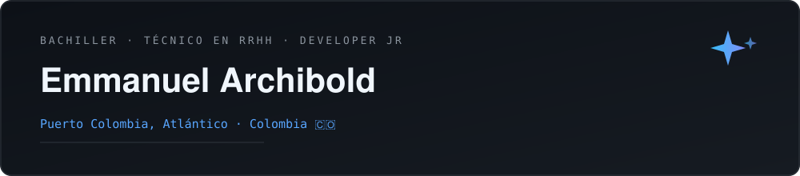

## Hi there 👋

I am Emmanuel, Full Stack Junior developer with a diverse technical and professional background that combines environmental science, human management and technology.

I am a Technologist in Environmental Prevention and Control and Natural Resources Technician, training that gave me a solid foundation in analysis, problem solving and structured work under technical regulations. I complemented this path with experience as a Human Resources Assistant, where I strengthened organizational, communication and process management skills within work teams.

Today I direct my career towards software development, with knowledge in JavaScript, TypeScript, Java, Python, SQL, HTML and CSS, encompassing both frontend and backend development. I also have a certification in Artificial Intelligence manipulation granted by the Governorate of the Atlantic, which allows me to integrate AI tools in my projects and workflows.

I am bilingual Spanish-English (level B2) and native speaker of Sanandresan Creole, which gives me an advantage to communicate in multicultural and remote work environments.

[GitHub](https://github.com/emmanuelarchi30-alt) · [LinkedIn](TU-LINK-LINKEDIN) · [Email](mail:TU-CORREO@gmail.com) · [WhatsApp](https://wa.me/TU-NUMERO-CON-CODIGO-PAIS)
